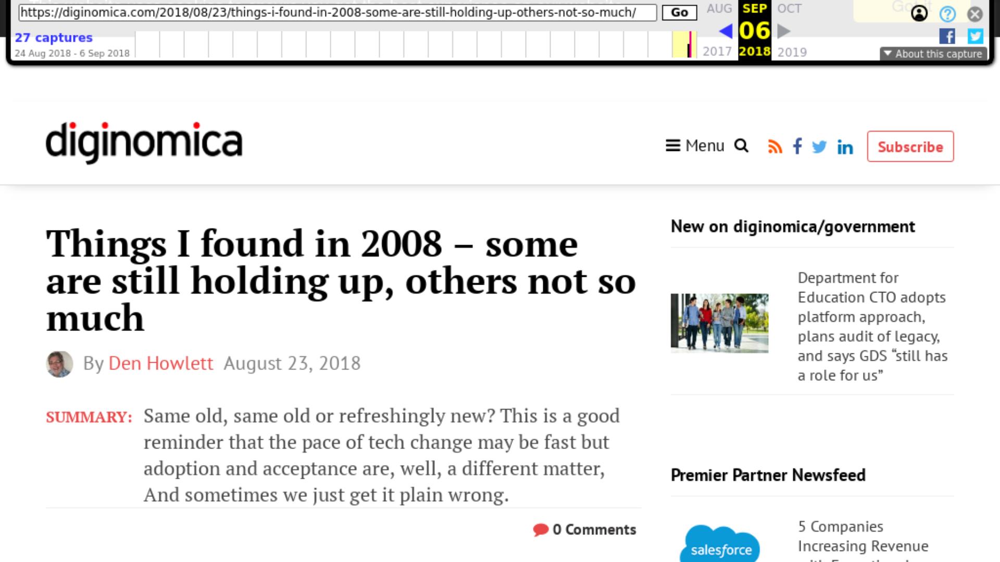

# Capture Images of Press Mentions
by Max Reinisch

## What is this?
Given a list of URLs from The Internet Archive [(For Example)](http://web.archive.org/web/20180906220053/https://www.laughingplace.com/w/news/2018/08/14/disney-character-lawsuit-hits-snag/
), this script can save an image of the site in 1080p.

## How to use it:
With Python v3.6 and a sub-directory named `imgs/` located in this program's directory, you can run this program by calling the following on the command line:

`python imgCapture.py urls.txt`

Where `urls.txt` looks like:

```
http://web.archive.org/web/20180906215025/https://diginomica.com/2018/08/23/things-i-found-in-2008-some-are-still-holding-up-others-not-so-much/
http://web.archive.org/web/20180906215036/https://londonlovesbusiness.com/five-essential-checks-before-buying-that-domain-name/
http://web.archive.org/web/20180906215058/https://www.dailydot.com/bazaar/plated-meals/
```
Note that the program does try to handle non-archive urls by looking them up in the archive before running them through the program.  


Results should look something like:



#### Didn't work?

If you run `ls`, make sure the result looks like this:

```
$ ls
bin/  imgCapture.py  imgs/  README.md  urls.txt  
```
